<h1>🏋️‍♂️ BeastMode Web/App</h1>

<strong>Autore:</strong> Alessandro Longo

<strong>Concept:</strong> Piattaforma digitale (Web + App) che offre <em>schede di allenamento personalizzate</em> e <em>piani alimentari su misura</em>, integrati con <strong>video-esecuzioni, supporto da coach e monitoraggio progressi</strong>. Include anche <em>contenuti video marketing</em> per promuovere il brand e la community.

<h2>🎯 Missione</h2>

<em>“Sapere come comportarsi per ottenere i massimi risultati è spesso complesso. Con questa Web/App è tutto più semplice.”</em>

<h2>💡 Problema</h2>

Molte persone si allenano in palestra o a casa senza una guida chiara, ottenendo <strong>pochi risultati</strong> o <strong>stagnando</strong>. Manca una piattaforma che unisca <strong>personalizzazione, educazione tecnica e supporto umano</strong> in un’unica esperienza digitale.

<h2>👥 Target</h2>
<ul>
  <li>Uomini e donne (18–60 anni) che frequentano la palestra o si allenano da soli</li>
  <li>Livelli: principianti, intermedi, avanzati</li>
  <li>Obiettivi: dimagrimento, forza, definizione, massa, ricomposizione corporea</li>
  <li>Persone che vogliono <strong>vedere progressi concreti</strong> e <strong>imparare la corretta esecuzione</strong></li>
</ul>

<h2>⚔️ Competitors</h2>

<table>
  <thead>
    <tr>
      <th>⚙️ Caratteristica</th>
      <th>⭐ Importanza</th>
      <th>💪 BeastMode</th>
      <th>🟠 FitBod</th>
      <th>🔵 Tracked</th>
      <th>🔴 BitDifferent</th>
    </tr>
  </thead>
  <tbody>
    <tr><td>Schede personalizzate basate su obiettivi e livello</td><td>🔥 High</td><td>🟢 Complete e adattive</td><td>🟢 Buone ma standard</td><td>🟠 Parziali</td><td>🔴 Non dinamiche</td></tr>
    <tr><td>Piano alimentare integrato</td><td>🔥 High</td><td>🟢 Personalizzato e sincronizzato ai progressi</td><td>🔴 Assente</td><td>🟠 Solo consigli base</td><td>🔴 Non previsto</td></tr>
    <tr><td>Video-esecuzioni esercizi</td><td>🔥 High</td><td>🟢 Completi e didattici</td><td>🟠 Limitati</td><td>🟠 Parziali</td><td>🔴 Assenti</td></tr>
    <tr><td>Interazione con coach</td><td>🔥 High</td><td>🟢 Chat e feedback diretti</td><td>🔴 Nessuna</td><td>🟠 Solo community</td><td>🔴 Assente</td></tr>
    <tr><td>Monitoraggio progressi</td><td>🔥 High</td><td>🟢 Grafici e metriche corpo/forza</td><td>🟢 Presente</td><td>🟢 Presente</td><td>🔴 Assente</td></tr>
    <tr><td>Marketing e community video</td><td>🟡 Moderate</td><td>🟢 Contenuti motivazionali editati</td><td>🔴 Non previsti</td><td>🔴 Non previsti</td><td>🔴 Non previsti</td></tr>
    <tr><td>Prezzo accessibile</td><td>🔥 High</td><td>🟢 Abbonamento flessibile</td><td>🟠 Medio</td><td>🟠 Medio</td><td>🟢 Gratis ma limitato</td></tr>
    <tr><td>Nessuna pubblicità</td><td>🔥 High</td><td>🟢 Nessuna</td><td>🟢 Nessuna</td><td>🟢 Nessuna</td><td>🟠 Possibile</td></tr>
  </tbody>
</table>

<h2>🧠 Tagline</h2>

<em>“Il tuo corpo. Il tuo percorso. La tua guida digitale verso il risultato.”</em>

<h2>🧩 Funzionalità Principali</h2>

<h3>🔹 Funzionali</h3>
<ol>
  <li>Registrazione, login e recupero password</li>
  <li>Creazione profilo utente con dati fisici, obiettivi e livello</li>
  <li>Schede di allenamento personalizzate</li>
  <li>Piani alimentari integrati</li>
  <li>Video-esecuzioni di ogni esercizio</li>
  <li>Tracking progressi (peso, misure, carichi, performance)</li>
  <li>Chat e interazione con coach</li>
  <li>Notifiche e reminder</li>
  <li>Sezione video marketing</li>
  <li>Dashboard risultati e grafici</li>
  <li>Gamification (badge, progress bar, ranking)</li>
</ol>

<h2>📖 User Stories – BeastMode Web/App</h2>

<table>
  <thead>
    <tr>
      <th>Attore (Come...)</th>
      <th>Requisito / Azione (Voglio...)</th>
      <th>Beneficio (In modo da...)</th>
    </tr>
  </thead>
  <tbody>
    <tr><td>Utente</td><td>Registrarmi alla piattaforma</td><td>Creare un account e accedere ai servizi personalizzati</td></tr>
    <tr><td>Utente</td><td>Effettuare il login</td><td>Accedere al mio profilo e alle funzionalità riservate</td></tr>
    <tr><td>Utente</td><td>Recuperare la password</td><td>Ripristinare l’accesso in caso di smarrimento</td></tr>
    <tr><td>Utente</td><td>Gestire il mio profilo</td><td>Aggiornare dati fisici, obiettivi e preferenze</td></tr>
    <tr><td>Utente</td><td>Creare schede di allenamento personalizzate</td><td>Allenarmi secondo i miei obiettivi e livello</td></tr>
    <tr><td>Utente</td><td>Creare piani alimentari su misura</td><td>Seguire una nutrizione compatibile con l’allenamento</td></tr>
    <tr><td>Utente</td><td>Visualizzare video tutorial</td><td>Eseguire correttamente gli esercizi</td></tr>
    <tr><td>Utente</td><td>Monitorare i miei progressi</td><td>Valutare i miglioramenti tramite grafici e dashboard</td></tr>
    <tr><td>Utente</td><td>Ricevere feedback dai coach</td><td>Correggere esercizi e migliorare le prestazioni</td></tr>
    <tr><td>Utente</td><td>Interagire con la community</td><td>Trovare motivazione e supporto</td></tr>
    <tr><td>Utente</td><td>Gestire abbonamento</td><td>Accedere a contenuti Premium e Coach+</td></tr>
    <tr><td>Utente → Sistema di Pagamento</td><td>Effettuare pagamenti sicuri</td><td>Completare transazioni per abbonamenti e servizi aggiuntivi</td></tr>
    <tr><td>Amministratore</td><td>Effettuare il login con privilegi</td><td>Accedere alle funzioni di gestione e controllo della piattaforma</td></tr>
    <tr><td>Amministratore</td><td>Gestire contenuti e schede</td><td>Aggiungere, modificare o rimuovere schede, piani e video</td></tr>
    <tr><td>Amministratore → Coach</td><td>Verificare la qualità dei piani e contenuti</td><td>Assicurare che gli allenamenti e la nutrizione siano corretti e aggiornati</td></tr>
  </tbody>
</table>
<h3>🔹 Non Funzionali</h3>
<ul>
  <li>Interfaccia moderna, chiara e intuitiva</li>
  <li>Caricamento rapido e fluido</li>
  <li>Compatibilità multipiattaforma (Web, iOS, Android)</li>
  <li>Alta disponibilità (99.9%)</li>
  <li>Nessuna pubblicità</li>
  <li>Protezione dati e privacy (GDPR)</li>
  <li>Design responsive e motivante</li>
</ul>

<h3>🔹 Di Dominio</h3>
<ul>
  <li>Contenuti video e piani protetti da copyright</li>
  <li>Dati utente trattati in conformità al GDPR</li>
  <li>Abbonamenti mensili/trimestrali (Base, Premium, Coach+)</li>
  <li>Integrazione dispositivi fitness (Apple Health, Google Fit, Garmin)</li>
</ul>

<h2>⚙️ Tecnologie</h2>

<ul>
  <li><strong>Frontend:</strong> Next.js (React) + Tailwind CSS | Mobile: React Native o Flutter</li>
  <li><strong>Backend:</strong> Node.js con NestJS | API REST + WebSocket</li>
  <li><strong>Database:</strong> PostgreSQL + Redis</li>
  <li><strong>Autenticazione:</strong> OAuth 2.0 / JWT (Auth0 o Firebase)</li>
  <li><strong>Pagamenti:</strong> Stripe</li>
  <li><strong>Storage:</strong> AWS S3 + Cloudflare CDN</li>
  <li><strong>Machine Learning:</strong> TensorFlow / PyTorch Lite (personalizzazione schede)</li>
  <li><strong>Hosting:</strong> AWS / Google Cloud / Vercel</li>
  <li><strong>Sicurezza:</strong> HTTPS, AES, bcrypt, 2FA</li>
  <li><strong>Monitoraggio:</strong> Sentry + Mixpanel / Google Analytics</li>
  <li><strong>CI/CD:</strong> GitHub + GitHub Actions</li>
</ul>

<h2>📊 Analisi dei Requisiti – BeastMode Web/App</h2>

<section id="descrizione-requisiti">
  <h3>Descrizione dei requisiti</h3>
  
La piattaforma di fitness digitale BeastMode consente agli utenti di registrarsi, accedere tramite login sicuro e recuperare la password in caso di smarrimento. Ogni utente autenticato può gestire il proprio profilo personale e utilizzare le funzionalità principali del sistema (<strong>funzionale</strong>).

  
Gli utenti possono creare schede di allenamento personalizzate, impostare piani nutrizionali su misura, visualizzare video tutorial e monitorare i propri progressi tramite dashboard e grafici (<strong>funzionale</strong>).

  
È possibile ricevere feedback diretto dai coach e interagire con la community per supporto e motivazione (<strong>funzionale</strong>).

  
Il sistema gestisce pagamenti sicuri per eventuali servizi aggiuntivi o abbonamenti, integrati con Stripe per autorizzazione e validazione delle transazioni (<strong>funzionale</strong>).

  
Gli amministratori accedono con login privilegiato per gestire contenuti, schede di allenamento, piani nutrizionali e video tutorial, garantendo l’accuratezza dei contenuti (<strong>funzionale</strong>).

</section>

<section id="requisiti-non-funzionali">
  <h3>Requisiti Non Funzionali</h3>
  <ul>
    <li>Interfaccia semplice, chiara e intuitiva per utenti di qualsiasi livello</li>
    <li>Tempi di risposta rapidi e disponibilità continua</li>
    <li>Compatibilità multipiattaforma: Web, iOS, Android</li>
    <li>Scalabilità modulare e facilità di manutenzione</li>
    <li>Nessuna pubblicità</li>
    <li>Sicurezza e privacy conformi a GDPR</li>
  </ul>
</section>

<section id="requisiti-dominio">
  <h3>Requisiti di Dominio</h3>
  <ul>
    <li>Tutti i contenuti video e piani sono protetti da copyright</li>
    <li>Gestione abbonamenti e pagamenti sicuri tramite Stripe</li>
    <li>Integrazione con dispositivi fitness: Apple Health, Google Fit, Garmin</li>
    <li>Protezione dei contenuti tramite DRM e watermark dinamici</li>
    <li>Conformità alle norme di privacy e agli standard di accessibilità (WCAG)</li>
  </ul>
</section>
<h2>📊 UML Use Case</h2>

<section id="intro">
  
Scopri <strong>BeastMode</strong>, la piattaforma digitale che unisce allenamenti personalizzati, piani nutrizionali e supporto dei coach in un’unica Web/App.

  
Accedi al tuo percorso di fitness su <a href="https://beastmode-your-fit-plan.lovable.app" target="_blank">beastmode-your-fit-plan.lovable.app</a> e trasforma i tuoi allenamenti in risultati misurabili.

</section>

<h2>Elevator Pitch e Business Model – BeastMode Web/App</h2>

<section id="opening-slide">
  <h3>Slide 1: Opening Slide</h3>
  
<strong>Nome Azienda:</strong> BeastMode

  
<strong>Progetto:</strong> Fitness Digitale Personalizzato

  
<strong>Contatto:</strong> Alessandro Longo – <a href="mailto:alessandro.longo@email.com">alessandro.longo@email.com</a>

  
<em>Slogan:</em> “Allenati meglio, misura i tuoi progressi, raggiungi i tuoi obiettivi.”

</section>

<section id="problema">
  <h3>Slide 2: Il Problema</h3>
  
Molti utenti si allenano in palestra o a casa senza una guida chiara. Questo porta a <strong>risultati limitati, stagnazione e frustrazione</strong>.

  
Non esiste ancora una piattaforma che combini:

  <ul>
    <li>Programmi di allenamento personalizzati</li>
    <li>Nutrizione su misura</li>
    <li>Supporto da coach</li>
    <li>Monitoraggio dei progressi in un’unica esperienza digitale</li>
  </ul>
</section>

<section id="soluzione">
  <h3>Slide 3: La Soluzione</h3>
  
BeastMode offre una piattaforma digitale (Web + App) che permette di:

  <ul>
    <li>Creare schede di allenamento personalizzate in base a obiettivi e livello</li>
    <li>Fornire piani nutrizionali su misura, integrati con allenamenti</li>
    <li>Visualizzare video tutorial dettagliati per ogni esercizio</li>
    <li>Ricevere supporto e feedback diretto dai coach</li>
    <li>Monitorare i progressi con grafici e dashboard motivanti</li>
    <li>Accedere a contenuti video motivazionali e community</li>
  </ul>
</section>

<section id="business-model">
  <h3>Slide 4: Business Model</h3>

  <h4>Modello Freemium con abbonamenti premium</h4>
  <ul>
    <li>Accesso gratuito alle funzionalità base</li>
    <li>Upgrade a piani Premium e Coach+</li>
    <li>Monetizzazione tramite abbonamenti mensili, trimestrali o annuali</li>
    <li>Nessuna pubblicità</li>
  </ul>

  <h4>Ricavi principali</h4>
  <ul>
    <li>Abbonamenti flessibili: Base, Premium, Coach+</li>
  </ul>

  <h4>Utilizzo del prestito richiesto (125.000 €)</h4>
  <ul>
    <li>Sviluppo Web/App e MVP</li>
    <li>Produzione contenuti video</li>
    <li>Integrazione con coach e strumenti di monitoraggio</li>
    <li>Marketing iniziale e acquisizione utenti</li>
  </ul>
</section>

<section id="mercato">
  <h3>Slide 5: Dimensione del Mercato</h3>
  
Il settore del fitness digitale è in forte crescita: app di allenamento, nutrizione e coaching online hanno milioni di utenti in Europa.

  
Il mercato cresce di oltre 15% all’anno, con aumento della domanda di servizi personalizzati e integrati.

  
BeastMode si colloca nell’intersezione tra app di fitness, coaching digitale e community motivazionale.

</section>

<section id="tecnologia">
  <h3>Slide 6: Tecnologia e Expertise</h3>
  <ul>
    <li>Frontend: Next.js + Tailwind / React Native o Flutter</li>
    <li>Backend: Node.js + NestJS, API REST e WebSocket</li>
    <li>Machine Learning: personalizzazione schede e piani alimentari (TensorFlow / PyTorch Lite)</li>
    <li>Sicurezza e dati: GDPR, HTTPS, protezione utenti</li>
    <li>Pagamenti e abbonamenti: Stripe</li>
    <li>Integrazione dispositivi fitness: Apple Health, Google Fit, Garmin</li>
  </ul>
</section>

<section id="competitor">
  <h3>Slide 7: Competitor</h3>
  <table>
    <thead>
      <tr>
        <th>Funzionalità</th>
        <th>BeastMode</th>
        <th>FitBod</th>
        <th>Tracked</th>
        <th>BitDifferent</th>
      </tr>
    </thead>
    <tbody>
      <tr><td>Schede personalizzate</td><td>✅ Complete e adattive</td><td>Buone</td><td>Parziali</td><td>Limitate</td></tr>
      <tr><td>Piani alimentari</td><td>✅ Personalizzati</td><td>❌</td><td>Base</td><td>❌</td></tr>
      <tr><td>Video tutorial</td><td>✅ Completi</td><td>Limitati</td><td>Parziali</td><td>❌</td></tr>
      <tr><td>Feedback coach</td><td>✅ Chat & supporto</td><td>❌</td><td>Solo community</td><td>❌</td></tr>
      <tr><td>Progressi tracciati</td><td>✅ Grafici e metriche</td><td>✅</td><td>✅</td><td>❌</td></tr>
      <tr><td>Community e contenuti</td><td>✅ Motivazionali</td><td>❌</td><td>❌</td><td>❌</td></tr>
      <tr><td>Prezzo</td><td>✅ Abbonamento flessibile</td><td>Medio</td><td>Medio</td><td>Limitato</td></tr>
      <tr><td>Nessuna pubblicità</td><td>✅</td><td>✅</td><td>✅</td><td>Possibile</td></tr>
    </tbody>
  </table>
</section>

<section id="vantaggi">
  <h3>Slide 8: Perché BeastMode è migliore</h3>
  <ul>
    <li>Personalizzazione reale grazie al Machine Learning</li>
    <li>Allenamento + nutrizione + coaching in un’unica app</li>
    <li>Progressi chiari, misurabili e motivanti</li>
    <li>Community e contenuti video per engagement</li>
    <li>Prezzo flessibile, nessuna pubblicità, adatto a tutti</li>
  </ul>
</section>

<section id="acquisizione">
  <h3>Slide 9: Canali di Acquisizione Utenti</h3>
  <ul>
    <li>Social e community: Instagram, TikTok, YouTube</li>
    <li>Referral program: “invita un amico” per completare i gruppi di utenti</li>
    <li>Collaborazioni con coach e influencer fitness</li>
  </ul>
</section>

<section id="team">
  <h3>Slide 10: Team Fondatore</h3>
  <ul>
    <li>Alessandro Longo – Founder & CEO (Visione e strategia)</li>
    <li>[CTO] – Sviluppo Web/App e integrazione ML</li>
    <li>[Marketing Lead] – Growth, community e social media</li>
  </ul>
</section>

<section id="milestones">
  <h3>Slide 11: Milestones & Prestito Richiesto</h3>
  <ul>
    <li>Obiettivo primi 6 mesi: sviluppare MVP e testare il progetto con i primi utenti</li>
    <li>Target 6 mesi: 1.000+ utenti attivi e completamento dello sviluppo</li>
    <li>Prestito richiesto: 100.000 € per sviluppo, contenuti, integrazione coach e marketing iniziale</li>
  </ul>
</section>

<section id="elevator-pitch-beastmode" class="py-8 px-4 bg-gray-50 dark:bg-gray-800">
  

    <h2 class="text-3xl font-bold mb-4 text-gray-900 dark:text-white">Elevator Pitch – BeastMode</h2>
    

      Ciao, sono <strong>Alessandro Longo</strong>, fondatore di <strong>BeastMode</strong>. Sapete che la mancanza di guida personalizzata e motivazione è la principale barriera che frena molte persone nei loro obiettivi di fitness? Abbiamo creato BeastMode per abbattere questa barriera.
    

    

      BeastMode è una piattaforma digitale che integra allenamenti personalizzati, piani nutrizionali su misura, video tutorial dettagliati e supporto diretto dei coach. A differenza delle app generiche, con noi hai programmi su misura, progressi misurabili e motivazione costante.
    

    

      Abbiamo già progettato l’infrastruttura tecnologica con dashboard interattive, tracking dei progressi e integrazione con dispositivi fitness. I pagamenti e gli abbonamenti sono sicuri e senza pubblicità.
    

    

      Oggi cerchiamo un investimento iniziale di <strong>125.000€</strong> per completare lo sviluppo del MVP, produrre contenuti video, integrare i coach e lanciare il progetto sul mercato. Siete pronti a rivoluzionare con noi il modo in cui le persone si allenano?
    

    <a href="#contact" class="inline-block px-6 py-3 bg-blue-600 text-white font-semibold rounded-lg shadow hover:bg-blue-700 transition">
      Unisciti a noi
    </a>
  

</section>

# BeastMode Web/App - Work Breakdown Structure (WBS)

```mermaid
graph TD
    A["BeastMode<br/>(€100k - 6 Mesi)"] --> B["Pianificazione & PM<br/>(€5k - 3 sett.)"]
    A --> C["Design UI/UX<br/>(€10k - 4 sett.)"]
    A --> D["Sviluppo Frontend<br/>(€25k - 8 sett.)"]
    A --> E["Sviluppo Backend<br/>(€20k - 8 sett.)"]
    A --> F["Contenuti & Video<br/>(€15k - 6 sett.)"]
    A --> G["Integrazione Coach & ML<br/>(€5k - 3 sett.)"]
    A --> H["Testing & QA<br/>(€5k - 3 sett.)"]
    A --> I["Marketing & Lancio<br/>(€10k - 4 sett.)"]
    A --> J["Supporto & Manutenzione<br/>(€5k - 4 sett.)"]

    B --> B1["Definizione Requisiti<br/>(€1k - 1 sett.)"]
    B --> B2["Analisi Competitor<br/>(€1k - 1 sett.)"]
    B --> B3["Definizione MVP<br/>(€2k - 1 sett.)"]
    B --> B4["WBS & Pianificazione<br/>(€1k - 1 sett.)"]

    C --> C1["Wireframe & Prototipi<br/>(€3k - 1 sett.)"]
    C --> C2["Mockup ad Alta Fedeltà<br/>(€4k - 2 sett.)"]
    C --> C3["User Testing<br/>(€3k - 1 sett.)"]

    D --> D1["Web Responsive Next.js<br/>(€10k - 4 sett.)"]
    D --> D2["App Mobile iOS/Android<br/>(€15k - 4 sett.)"]

    E --> E1["API REST & WebSocket<br/>(€5k - 2 sett.)"]
    E --> E2["Database PostgreSQL + Redis<br/>(€5k - 2 sett.)"]
    E --> E3["Integrazione ML TensorFlow/PyTorch<br/>(€5k - 2 sett.)"]
    E --> E4["Sicurezza & Autenticazione<br/>(€5k - 2 sett.)"]

    F --> F1["Video Tutorial Esercizi<br/>(€7k - 3 sett.)"]
    F --> F2["Piani Alimentari Personalizzati<br/>(€5k - 2 sett.)"]
    F --> F3["Schede Allenamento<br/>(€3k - 1 sett.)"]

    G --> G1["Chat & Feedback Coach<br/>(€3k - 2 sett.)"]
    G --> G2["Dashboard Progressi & Grafici<br/>(€2k - 1 sett.)"]

    H --> H1["Bug Fixing<br/>(€2k - 1 sett.)"]
    H --> H2["Test Utente<br/>(€3k - 2 sett.)"]

    I --> I1["Campagne Social<br/>(€5k - 2 sett.)"]
    I --> I2["Influencer & Community<br/>(€3k - 1 sett.)"]
    I --> I3["Landing Page & Assets<br/>(€2k - 1 sett.)"]

    J --> J1["Aggiornamenti Software<br/>(€3k - 2 sett.)"]
    J --> J2["Monitoraggio Performance<br/>(€2k - 2 sett.)"]
```

gantt
    title BeastMode - Piano Progetto (6 Mesi)
    dateFormat  YYYY-MM-DD
    excludes    weekends

    section PM
    Requisiti            :b1, 2026-03-01, 1w
    Competitor           :b2, after b1, 1w
    MVP                  :b3, after b2, 1w
    Planning             :b4, after b3, 1w

    section Design
    Wireframe            :c1, after b2, 1w
    Mockup               :c2, after c1, 2w
    User Test UX         :c3, after c2, 1w

    section Backend
    API                  :e1, after b4, 2w
    DB Setup             :e2, after e1, 2w
    ML Integration       :e3, after e2, 2w
    Security/Auth        :e4, after e3, 2w

    section Frontend
    Web App              :d1, after c3, 4w
    Mobile App           :d2, after d1, 4w

    section Content
    Video                :f1, after b4, 3w
    Nutrition Plans      :f2, after f1, 2w
    Workouts             :f3, after f2, 1w

    section Coach & ML
    Coach Chat           :g1, after e2, 2w
    Progress Dashboard   :g2, after g1, 1w

    section QA
    Bug Fix              :h1, after d2, 1w
    User Test            :h2, after h1, 2w

    section Marketing
    Social Campaign      :i1, after c3, 2w
    Influencer           :i2, after i1, 1w
    Landing Page         :i3, after i2, 1w

    section Support
    Updates              :j1, after h2, 2w
    Monitoring           :j2, after j1, 2w

    section Milestone
    Dev Complete         :milestone, m1, 2026-08-31, 0d
